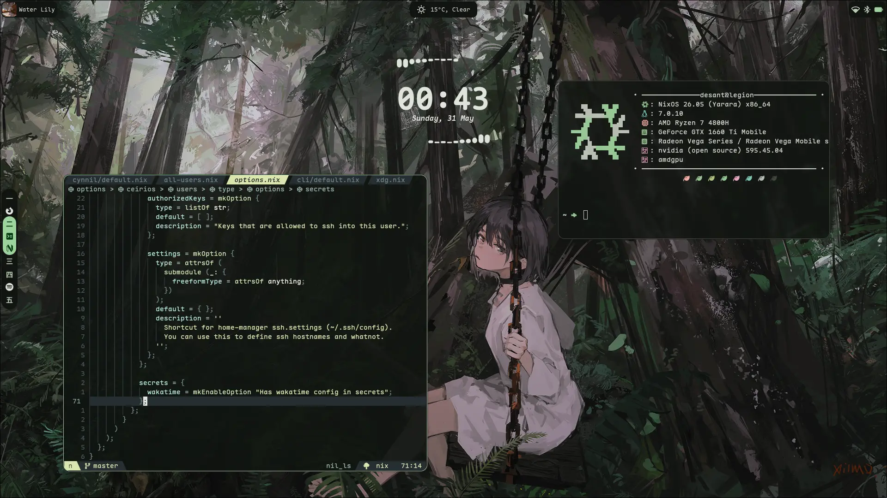

# NixOS dotfiles

## Installation and Usage
Check the [wiki](https://git.anturated.dev/anturated/dotfiles/wiki/Home)

## TODO
- [ ] wifi menu
- [ ] bluetooth menu
- [ ] power menu
- [ ] brightness/volume sliders
- [x] notifs
- [ ] better defaults customization
- [x] kale seems to not exit properly

## Thank/Credits
- [isabelroses/dotfiles](https://github.com/isabelroses/dotfiles) - HEAVILY based upon, will happily steal more
- [neon-grim/NixConfig](https://github.com/neon-grim/NixConfig) - initial idea for `kale` and multihost setup, and also what got me to even try
- [anturated/dotfiles](https://github.com/anturated/.dotfiles/tree/master/nixos) - my old horrible config
- wallpapers: [swing](https://www.pixiv.net/en/artworks/102808319)
